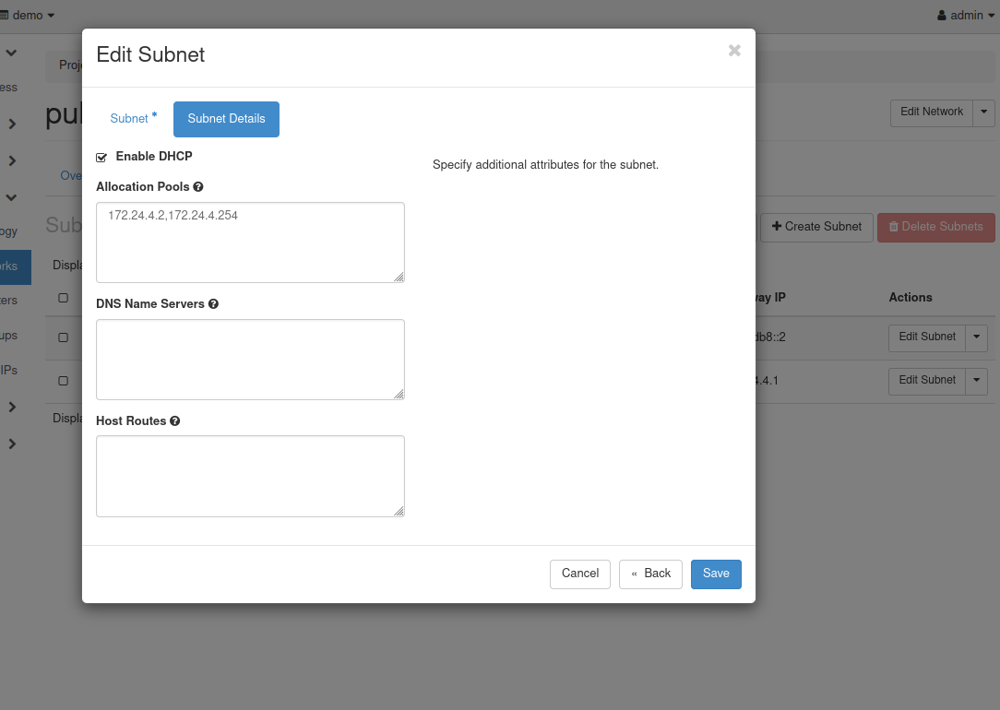
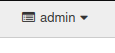
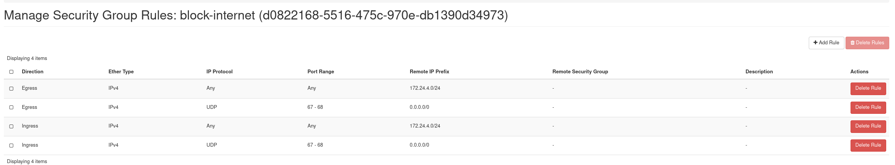
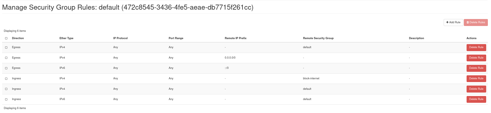
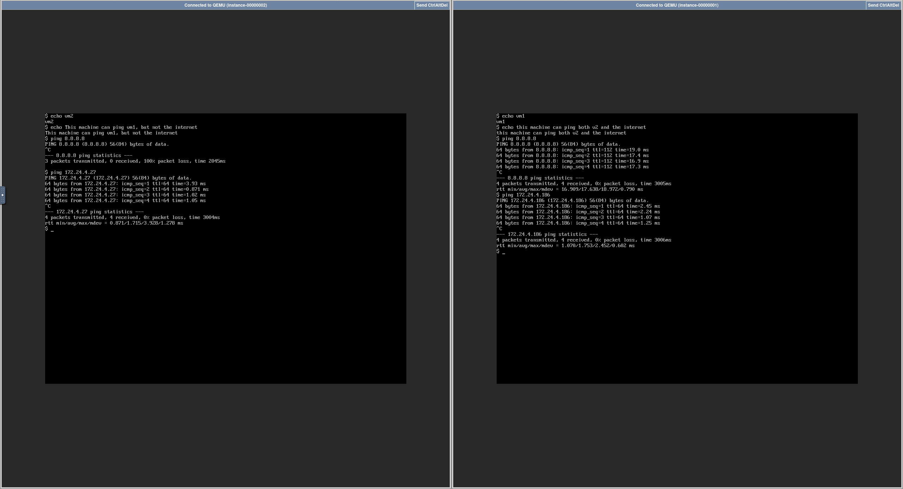

# Assignment 1: Creating VM-based services with OpenStack

> [!NOTE]
> As I was having trouble connecting to the presistent VM using the Client VM in crownlabs, I connected from my machine through ssh for the setup. Afterwards, I could start a ClientVM and access the dashboard through there.

To start, I log in to the admin dashboard and enable DHCP for the public subnets.

Then, I have to make sure I am in the admin project.

To allow block the internet for VM2, keep it for VM1 and allow for communication between VM1 and VM2, I created a security group called `block-internet`.
I also modified the `default` security group.
The `default` security group was applied to VM1, while `block-internet` was applied to VM2.

The rules I set are the following:

## Result

