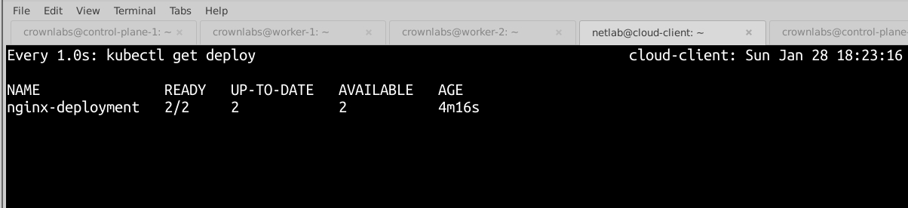

# GitOps in Kubernetes

## Setup the cluster

- For this part I only needed to follow the instructions from lab3;
- When creating the SSL tunnel I used the IP of the control-plane;

## Setup portainer GUI

- Ignore the security issues and use the command

```bash
kubectl rollout restart deployment portainer -n portainer
```

## Deploy an app with portainer

- The instructions were straightforward, when I forked the repo the number of replicas was 1, so I changed them to 2 to test.



## Final considerations

> [!IMPORTANT]
> **Questions:** Detail the advantages and disadvantages of adopting a GitOps workflow as opposed to using kubectl commands directly. Please highlight the main differences that became apparent to you when you were conducting the lab with kubectl and during the assignment that involved GitOps.

- **Advantages**: We get to use version control for the deployment which adds the option to rollback changes if needed, it makes the deployment process more transpacent and collaborative between team members, which also improves the consistency. Modifying the infrastructure also becomes simpler.

- During this assignment to change the number of replicas of a deployment I just had to commit the changes, while in the kubectl lab I needed to run multiple commands to configure everything.