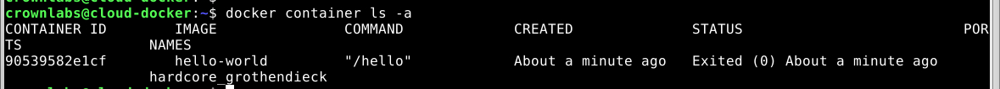
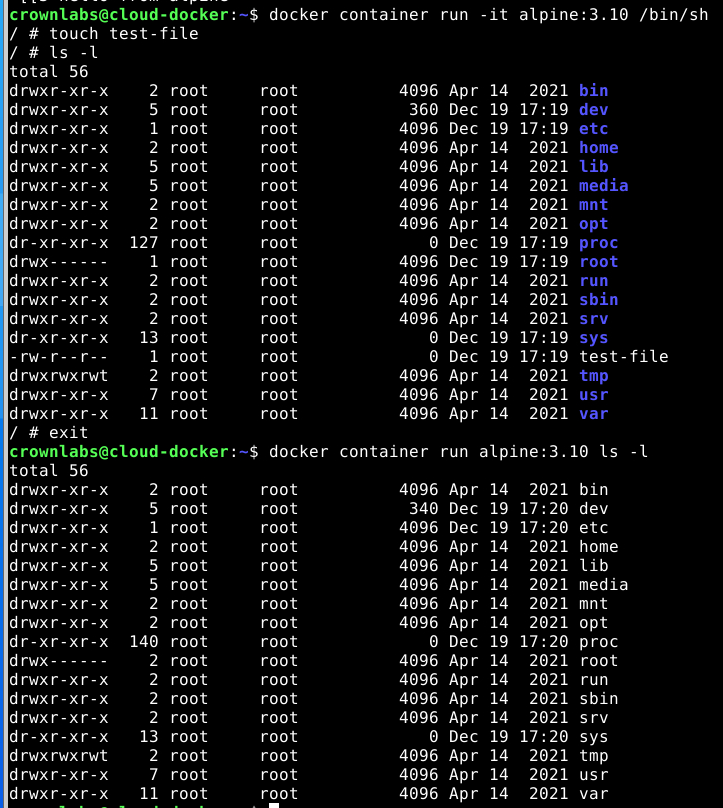
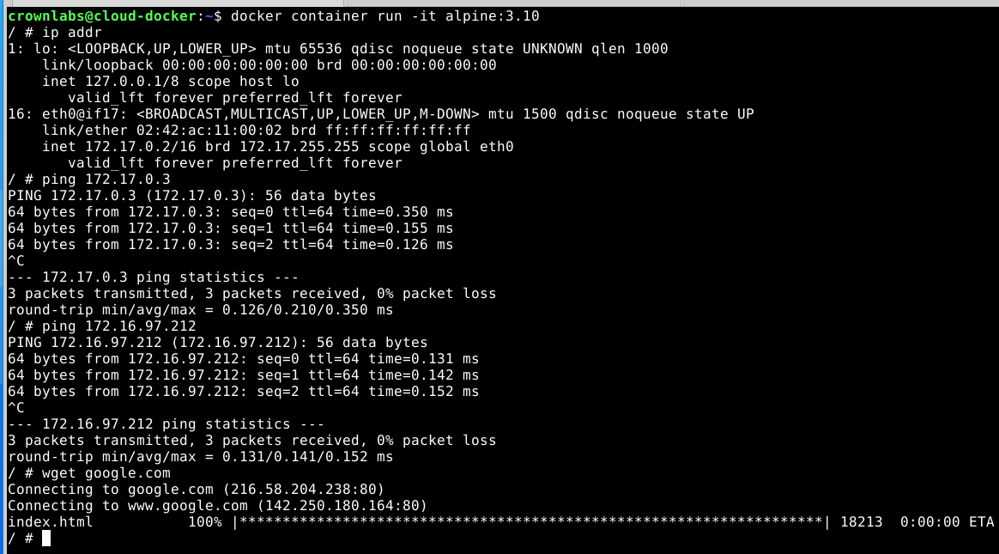

# Lab 2b: Introduction to Docker

## Section 2

> [!IMPORTANT] > **Exercise:** Take note of the name assigned to your container.

The name of the container is `hardcore_grothendieck`.

> [!IMPORTANT]
> Is test-file still present? Why?

`test-file` is not present in this new container because docker containers are isolated, meaning that a file created in a container is not available to other containers even if running the same image.

> [!IMPORTANT]
> Now, let’s run htop within the container. Does htop show the container or the host resources? Is
> this behaviour similar or different compared to what happens when dealing with virtual machines?

When running `htop` on a docker container, it will only show the resources of the container. Running the same command on a traditional VM would show the resources of the entire operating system

> [!IMPORTANT]
> How did the resource usage shown by htop change in this case? Are the resource constraints
> specified at container creation time enforced by the Linux kernel?

The CPU usage has increased for both CPUs.
However, the --cpus flag does not necessarily prevent the container from using multiple CPU cores if available; it restricts the container to a specified fraction of the total CPU resources. So we can see that both CPUs are being used by the stress test.

> [!IMPORTANT]
> Open two terminals and create two new Alpine
> containers with an interactive shell as you did previously in Section 2.2.3.
> Inspect the IP addresses assigned to the containers (command ip addr) and answer to the following
> questions, using some additional commands (e.g., ping and wget) if needed:
> Can the two containers communicate to each other?
> Can a container ping the host machine?
> Is the Internet reachable from the containers?
> From the information you gained, what is the default network configuration in Docker?

The two containers can communicate with each other using ping. They can also ping the host machine. They can also access the internet. Docker uses a bridge network through which the connected containers can communicate with each other using addresses in the range of `172.17.0.X`

Continue from section 2.4