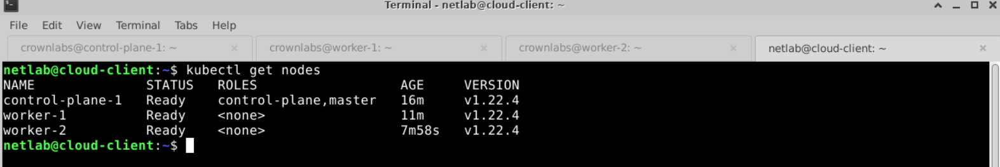
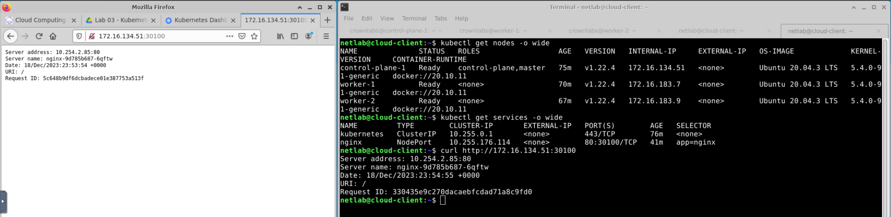
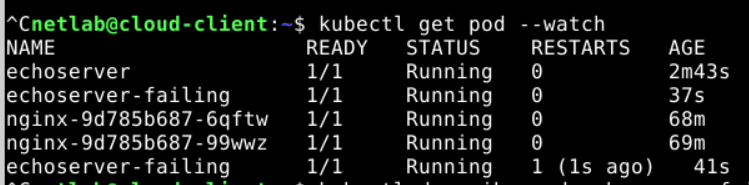
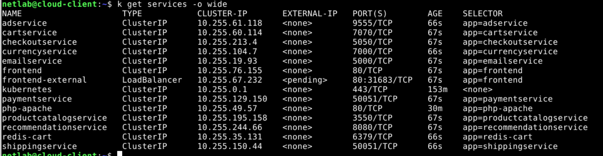
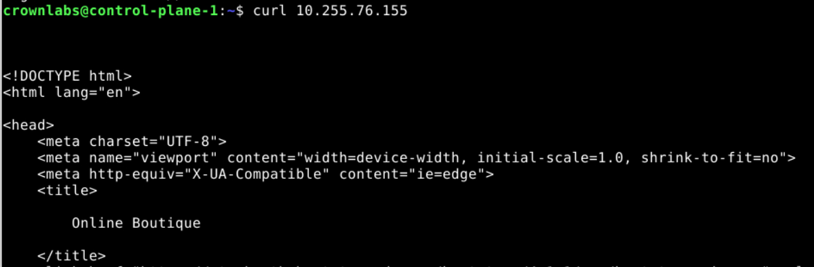
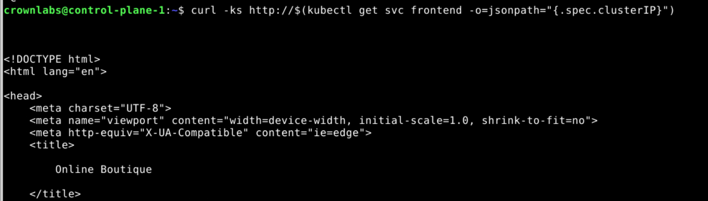
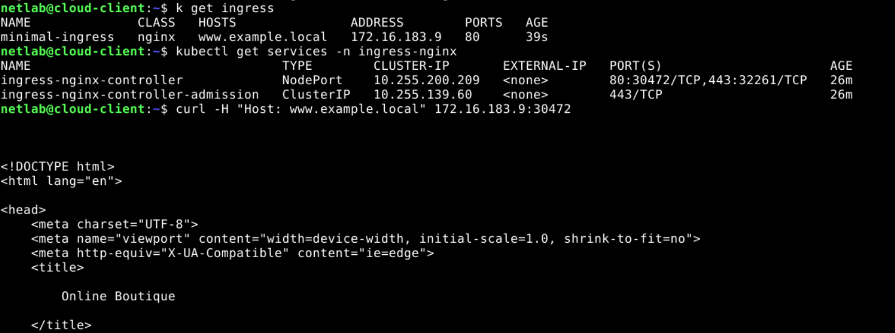

# Lab 3: Introduction to Kubernetes

## Section 2

For this section I setup a cluster with a `control-plane-1` node and two workers `worker-1` and `worker-2`.

> [!NOTE]
> On 2.3 I had to use `/home/crownlabs` instead of `~/`



## Section 3

> [!IMPORTANT] > **Question:** This command has to be executed from a node of the cluster to work. Why?
> **My answer:** ClusterIP services can only be accessed from within the cluster.

To access the deployed service form outside the cluster after having a NodePort service, I have to get the IP of one of the nodes and use the port that I allocated.



## Section 4

In this section I create a pod that fails periodically and see that k8s will restart it when it fails.


## Section 5

> [!IMPORTANT] > **Questions:** Which are the fields in the node resource that state the available resources? (They are two) Explain the meaning of those fields by leveraging the “kubectl explain“ tool.
> **My answers:** The two fields are `allocatable`, which represents the resources that are currently available for scheduling, and `capacity`, which represents the total capacity of resources on the node.
> According to `kubectl explain`, Allocatable represents the resources of a node that are available for scheduling. Defaults to Capacity; Capacity represents the total resources of a node. More info: https://kubernetes.io/docs/concepts/storage/persistent-volumes#capacity

To limit the CPU usage, add the following lines to the pod configuration as shown in the example:

```yaml
resources:
  limits:
    cpu: 100m
```

## Section 6

> [!IMPORTANT] > **Exercise:** Let’s create a pod which is capable to interact with the API server and get the pod list as
> we do from our client with kubectl.
> Detect which identity is mounted in a specific pod we want to run.
> Hint: Have a look to the serviceaccount field when getting a pod resource (e.g. kubectl
> get pod -o yaml)
> Assign the correct permission to the pod service account. You can define a new role for the
> occasion or rely on existing clusterroles.

role.yaml

```yaml
apiVersion: rbac.authorization.k8s.io/v1
kind: Role
metadata:
  namespace: default
  name: new-role
rules:
  - apiGroups: [""]
    resources: ["pods"]
    verbs: ["get", "watch", "list"]
```

rolebinding.yaml

```yaml
apiVersion: rbac.authorization.k8s.io/v1
kind: RoleBinding
metadata:
 name: new-bind
 namespace: default
subjects:
- kind: ServiceAccount
 name: default
 namespace: default
roleRef:
 kind: Role
 name: new-role
 apiGroup: rbac.authorization.k8s.io
```

## Section 7

> [!IMPORTANT] > **Exercise:** Let’s have a look to the services we just created:
> How can we access to the front-end service?
> Why does the “frontend-external” service remain with a “Pending” external IP?
> **My answers:** The front-end service is of type ClusterIP, meaning that it can only be accessed from within the cluster. To do so, we can run `curl 10.255.76.155` from one of the nodes in the cluster, such as control-plane. The "frontend-external" service is of type LoadBalancer, meaning that it exposes the Service externally using a cloud provider’s load balancer. In this case, there is no cloud provider set up, so the service cannot use it.

For section 7.1, I apply the manifest in the link, getting the following services.



The frontent can be accessed from the cluster nodes.



> [!IMPORTANT] > **Exercise:** Exercise: Let’s inspect the frontend service of the application we just deployed:
> Can we access it directly? If yes, how?
> Let’s create an Ingress with the following values. What parts of the infrastructure are missing to properly use it?
> **My answers:** The frontend can be accessed directly from nodes within the cluster as done in previous lab sections. The infrastructure is missing a dns configuration to map www.example.local to the ingress ip.

To access the frontend directly from a node within the cluster:



To use the ingress to access the frontend:


