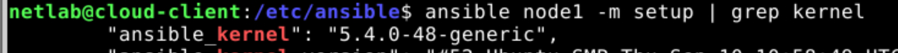

# Lab 4: Cloud Automation with Ansible

## Section 2

> [!NOTE]
> On 2.1.1 remember that the password for the user netlab is `netlab`.

## Section 3

> [!NOTE]
> Be aware, `ssh` can make the program hang asking for `[yes/no/fingerprint]`.

- Following the instructions, the master can now ping all the hosts:


- In 3.1.1, we see that `command` is more secure than `shell`, because it does not allow side effects and is not affected by the user's environment.


- We can see nginx running


## Section 4

- Using variables we can serve different pages in the different nodes.


> [!IMPORTANT]
> **Exercise:** try to retrieve the linux distribution and kernel version of all your managed nodes (Suggestion:
pass the output of setup module to grep command).




> [!IMPORTANT]
> **Exercise**: write a playbook that installs MariaDB only if the host has more than 3 GB of RAM.

```yaml
---
- name: MariaDB server installation
hosts: all
become: yes
tasks:
- name: Install latest MariaDB server when host RAM greater 3 GB
apt:
name: mariadb-server
state: latest
when: ansible_memtotal_mb > 3000
```

> [!IMPORTANT]
> change the template to use the FQDN (Fully Qualified Domain Name) hostname


## Section 5

> [!NOTE]
> I had some issues as the nginx config is now wrong from previous exercises.

- After dealing with the issue mentioned, it was working.

